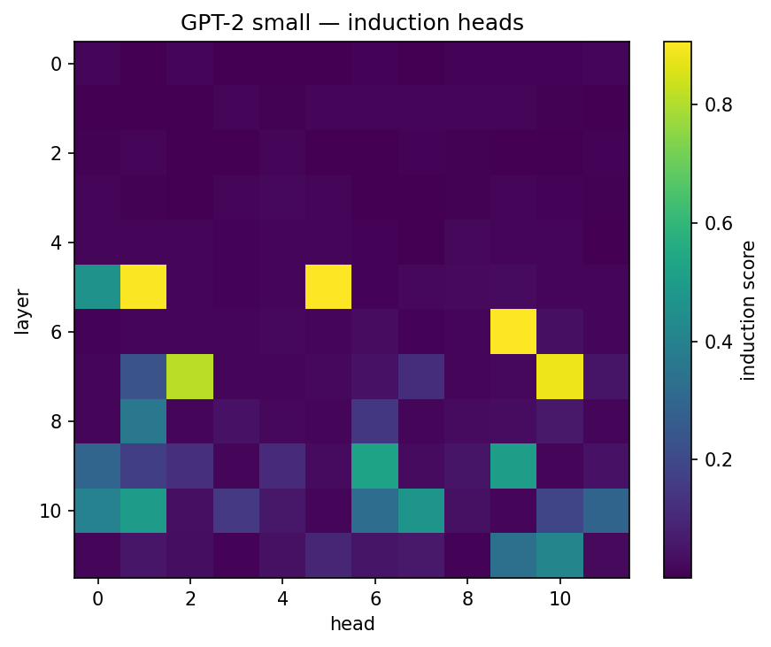
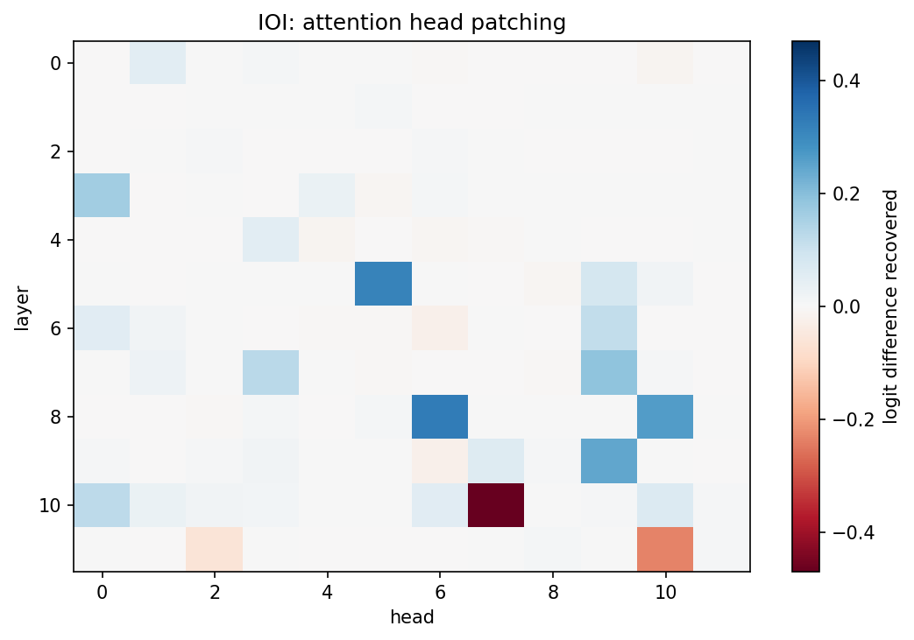
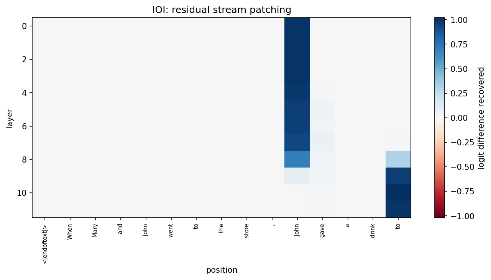

# interp-prep

Mechanistic interpretability reproductions on GPT-2 small with TransformerLens.
Pre-MSDS work, summer 2026, toward an interpretability capstone at JHU AMS.

## Progress

- [x] **Induction-head detection** (`src/induction_heads.py`)
- [x] **IOI circuit via activation patching** (`src/ioi_patching.py`)
- [ ] Sparse autoencoder features on the IOI circuit
- [ ] Steering-vector reachability (does a steered activation resemble any natural one?)

## Results

### Induction heads

Repeated-random-token test: score each head by how much attention it puts on the
token following the earlier copy of the current token.

Top heads: **L5H1 (0.90), L6H9 (0.90), L5H5 (0.91), L7H10 (0.89), L7H2 (0.82)** —
the canonical GPT-2 small induction heads.



### IOI circuit

Reproduces the localisation result from Wang et al. 2022, *Interpretability in the Wild*.
Clean and corrupted prompts differ only at the subject token, which flips the correct
answer. Patching a clean activation into the corrupted run measures how much of the
clean logit difference that site restores.

    clean logit diff:     +3.691
    corrupted logit diff: -3.997

Top heads by logit difference recovered, against their known role in the circuit:

| Head | Recovered | Known role |
|---|---|---|
| L8H6  | +0.328 | S-inhibition |
| L5H5  | +0.313 | induction |
| L8H10 | +0.264 | S-inhibition |
| L9H9  | +0.245 | name mover |
| L7H9  | +0.190 | S-inhibition |
| L3H0  | +0.162 | duplicate token |
| L7H3  | +0.129 | S-inhibition |
| L10H0 | +0.124 | name mover |

All four functional classes of the published circuit show up: duplicate-token heads
early, induction heads in the middle, S-inhibition around layers 7-8, name movers at
9-10. L5H5 appears in both experiments, which is consistent with induction heads being
reused by the IOI circuit.




## Notes and limitations

- Eight prompt pairs on a single template. The published work uses many more templates
  and both name orders (ABBA and BABA), so these numbers localise the circuit but do not
  establish it as carefully.
- Patching one site at a time misses redundancy. The backup name-mover heads only take
  over when the primary ones are ablated, so single-site patching understates them.
- No path patching yet, so this shows *where* the signal is, not how components compose.

## Setup

```bash
python -m venv .venv
.venv\Scripts\Activate.ps1
pip install -r requirements.txt

python src/induction_heads.py
python src/ioi_patching.py
```

GPT-2 small runs on CPU. The IOI sweep is ~340 forward passes and takes a few minutes.
