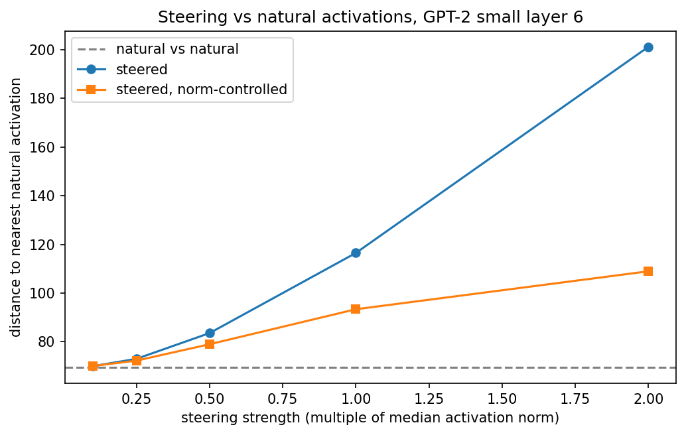
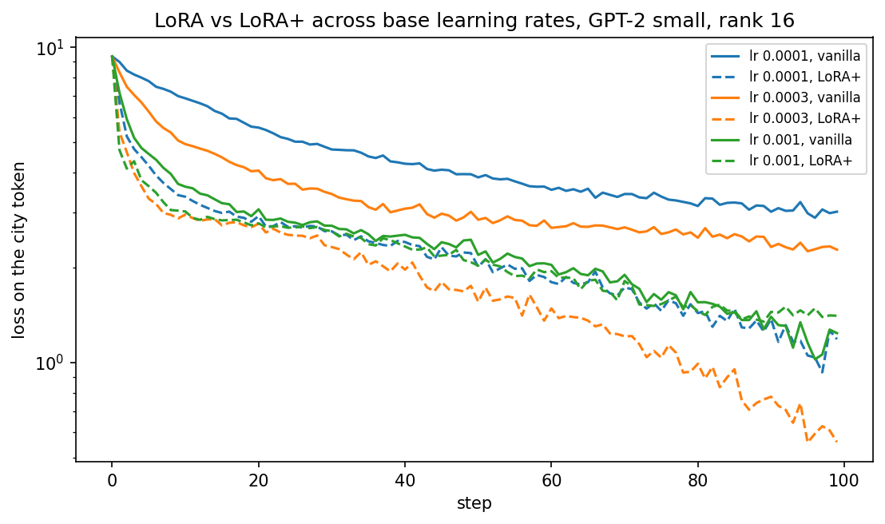

# interp-prep

Mechanistic interpretability reproductions on GPT-2 small with TransformerLens.
Pre-MSDS work, summer 2026, toward an interpretability capstone at JHU AMS.

## Progress

- [x] **Induction-head detection** (`src/induction_heads.py`)
- [x] **IOI circuit via activation patching** (`src/ioi_patching.py`)
- [x] **Steering-vector reachability** (`src/steering_reachability.py`)
- [x] **Metalinguistic judgment vs string probability** (`src/metalinguistic_gap.py`)
- [x] **LoRA vs LoRA+** (`src/lora_plus.py`)
- [ ] Sparse autoencoder features on the IOI circuit
- [ ] Path patching, to show how the IOI components compose

## Results

### Induction heads

Repeated-random-token test: score each head by how much attention it puts on the
token following the earlier copy of the current token.

Top heads: **L5H1 (0.90), L6H9 (0.90), L5H5 (0.91), L7H10 (0.89), L7H2 (0.82)** —
the canonical GPT-2 small induction heads.


### IOI circuit

Reproduces the localisation result from Wang et al. 2022, *Interpretability in the Wild*.
Clean and corrupted prompts differ only at the subject token, which flips the correct
answer. Patching a clean activation into the corrupted run measures how much of the
clean logit difference that site restores.

    clean logit diff:     +3.691
    corrupted logit diff: -3.997

Top heads by logit difference recovered, against their known role in the circuit:

| Head | Recovered | Known role |
|---|---|---|
| L8H6  | +0.328 | S-inhibition |
| L5H5  | +0.313 | induction |
| L8H10 | +0.264 | S-inhibition |
| L9H9  | +0.245 | name mover |
| L7H9  | +0.190 | S-inhibition |
| L3H0  | +0.162 | duplicate token |
| L7H3  | +0.129 | S-inhibition |
| L10H0 | +0.124 | name mover |

All four functional classes of the published circuit show up: duplicate-token heads
early, induction heads in the middle, S-inhibition around layers 7-8, name movers at
9-10. L5H5 appears in both experiments, which is consistent with induction heads being
reused by the IOI circuit.


### Steering reachability

A small check of the claim in Khashabi et al., *Steered LLM Activations are Non-Surjective*,
that steering pushes the residual stream off the manifold of prompt-reachable states.

A difference-in-means steering vector is added to held-out natural activations at layer 6,
and we measure the distance to the nearest activation in a natural corpus. Steering
strength is expressed as a multiple of the median activation norm, since absolute
coefficients are meaningless at this scale. The norm-controlled column rescales the
steered vector back to its original length, so the comparison isn't just detecting that
steering made the vector longer.

| Steering strength | NN distance | Norm-controlled | Excess surviving control |
|---|---|---|---|
| 0.10x norm | 69.9 | 70.0 | within noise |
| 0.25x | 73.0 | 72.2 | 79% |
| 0.50x | 83.6 | 79.0 | 67% |
| 1.00x | 116.5 | 93.4 | 51% |
| 2.00x | 201.2 | 108.9 | 30% |

Baseline distance between natural activations: 69.5. Median activation norm: 96.3.

Steered activations do sit further from the natural corpus, which is the direction the
paper predicts. But the effect degrades sharply under the norm control: at the strongest
setting only 30% of the excess distance survives, so most of the apparent departure is
the steering vector making the activation longer rather than moving it somewhere
qualitatively unreachable.



### Metalinguistic judgment vs string probability

A small check of the finding in Hu et al. that a model's direct metalinguistic judgments
diverge from what its string probabilities imply. 24 minimal pairs across six phenomena
(subject-verb agreement, determiner-noun agreement, anaphora, auxiliaries, word order,
verb form), asked two ways:

- **implicit** — compare mean per-token log probability of the grammatical sentence
  against the ungrammatical one
- **metalinguistic** — prompt "Is the following sentence grammatical?" and compare
  P(" Yes") against P(" No")

| Method | Correct |
|---|---|
| implicit (string probability) | **23/24 = 96%** |
| metalinguistic (asking the model) | **11/24 = 46%** |
| the two agree | 12/24 = 50% |

The gap is large and in the reported direction. But the diagnostic underneath it is what
matters: only **14.7%** of the model's probability mass falls on "Yes" or "No" combined,
and P(Yes) is nearly constant across items (mean 0.593, sd 0.080).

GPT-2 small is not answering the question. So the 46% does not isolate a failure to
introspect. A failure to follow the instruction accounts for it entirely, and at this
scale the two are not separable.

### LoRA vs LoRA+

Hayou et al. observe that a LoRA adapter's A and B matrices should not share a learning
rate, since B starts at zero and A does not. LoRA+ sets lr_B = lambda * lr_A.

The adapter is implemented directly rather than via a library, because the experiment is
about controlling per-matrix learning rates and that is easier to verify when the
parameters are explicit in the optimiser groups. Task: 128 synthetic person-to-city
associations, loss scored on the city token only. Rank 16, 100 steps.

| base lr | vanilla (lambda=1) | LoRA+ (lambda=16) | |
|---|---|---|---|
| 1e-4 | 3.009 | **1.186** | LoRA+ 61% better |
| 3e-4 | 2.280 | **0.559** | LoRA+ 76% better |
| 1e-3 | **1.239** | 1.407 | vanilla 14% better |

Best of each over the sweep: vanilla 1.239, LoRA+ 0.559.

**The first attempt got this backwards.** Running only at lr=1e-3, LoRA+ looked far worse
(1.43 against 0.55 at rank 16). That is the single setting in the sweep where it loses,
and the reason is that multiplying an already-tuned rate by 16 puts lr_B at 1.6e-2, which
is simply too large. Reusing a base rate tuned for vanilla LoRA is not a fair test of
LoRA+; the base rate has to be swept alongside lambda.



## Notes and limitations

**IOI**
- Eight prompt pairs on a single template. The published work uses many more templates
  and both name orders (ABBA and BABA), so these numbers localise the circuit but do not
  establish it as carefully.
- Patching one site at a time misses redundancy. The backup name-mover heads only take
  over when the primary ones are ablated, so single-site patching understates them.
- No path patching yet, so this shows *where* the signal is, not how components compose.

**Steering**
- The real problem is that "no prompt produces this activation" quantifies over all
  possible prompts, and a finite corpus cannot settle it. Nearest-neighbour distance is a
  weak stand-in for a preimage not existing.
- 360 activations in 768 dimensions is a sparse sample. Natural activations already sit
  a median of 69.5 apart when their norm is only 96.3, so the corpus does not trace out
  anything resembling a tight manifold at this sample size.
- No check that the steering vector actually changes behaviour at these strengths. A
  geometric departure that produces no behavioural effect would mean something different
  from one that does.

**LoRA+**
- Fixed 100-step budget, so this is a statement about convergence speed rather than final
  quality. An earlier 120-step run reached 0.546 with vanilla at lr=1e-3, close to LoRA+'s
  0.559 at 100 steps, so a longer budget may narrow the gap considerably.
- Synthetic memorisation of 128 associations, full-batch, one model size. Nothing here
  speaks to the scaling arguments the method is actually motivated by.
- Only lambda in {1, 16} and three base rates. The interaction between the two is clearly
  the whole story and deserves a finer grid.

**Metalinguistic gap**
- Only GPT-2 small was tested. The obvious next step is a small instruction-tuned model,
  where the Yes/No channel should actually engage, but then instruction tuning becomes a
  confound of its own.
- 24 hand-written minimal pairs is a small and unbalanced sample next to BLiMP.
- The metalinguistic result depends on one prompt format. A different phrasing, or
  few-shot examples, might recover the Yes/No channel entirely.

## Setup

```bash
python -m venv .venv
.venv\Scripts\Activate.ps1
pip install -r requirements.txt

python src/induction_heads.py
python src/ioi_patching.py
python src/steering_reachability.py
```

GPT-2 small runs on CPU. The IOI sweep is ~340 forward passes and takes a few minutes.
